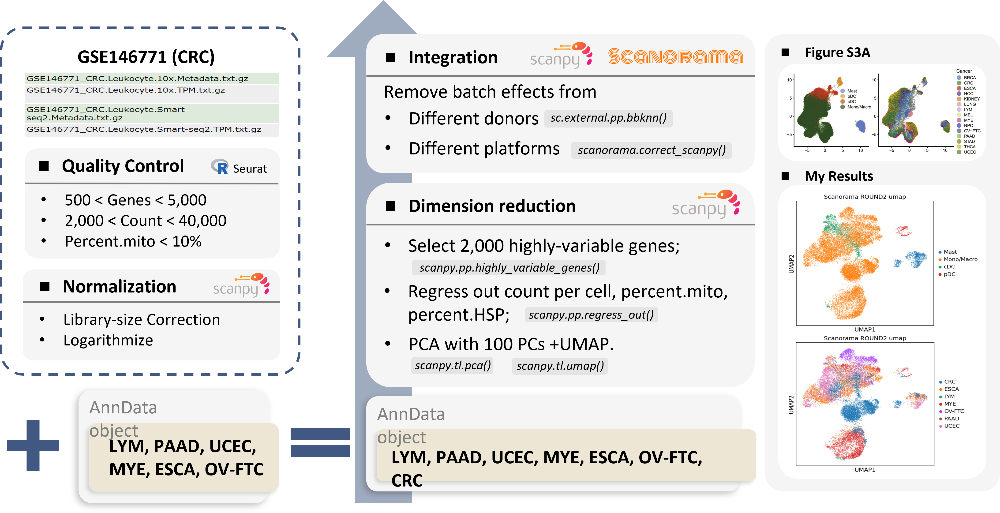

# 📙 Report

Author: ZHANG, Yiling\
Date: 27/10 - 5/11\
Paper:  [A pan-cancer single-cell transcriptional atlas of tumor infiltrating myeloid cells, Cheng,Sijin et al.,Cell,2021](https://www.cell.com/cell/fulltext/S0092-8674\(21\)00010-6#secsectitle0075)


Here is the **report** for assignment. Other notebooks and files please refer to:&#x20;

* Paper Reproduction Notebook: [paper-reproduction-notebook.md](paper-reproduction-notebook.md "mention")
* Data Exploration Notebook: [data-exploration-notebook.md](data-exploration-notebook.md "mention")
* Source Code: [GitHub-hiiiyilingzhang/PanMyeloid-assignment](https://github.com/hiiiyilingzhang/PanMyeloid-assignment)
* [troubleshooting.md](troubleshooting.md "mention")


## Summary

Single-cell RNA sequencing(scRNA-seq) continues to grow at an unprecedented pace, and while achievements and challenges co-exist when integrating data. Samples, conditions, modalities, or batches all deserve extra attention for data integration, which holds the promise for better characterization of cell identities. According to the statistics, 147 tools have been developed for scRNA-seq data integration\[1]. Understanding the idea of algorithm is extremely important for choosing analytical method. In this assignment, I replicated Figure S3A from the paper published on Cell [(Cheng et al., 2021)](https://www.cell.com/cell/fulltext/S0092-8674\(21\)00010-6#supplementaryMaterial), trying to integrate datasets with 7 cancer types, 46 patients and 45251 myeloid cells via bbknn and Scanorama. Furthermore, I employed other integration tools, like scGen, Harmony and LIGER, and evaluate the integration results with the help of LISI method.

## Data Description

I downloaded newly generated datasets([GSE154763](https://www.ncbi.nlm.nih.gov/geo/query/acc.cgi?acc=GSE154763)) for LYM, PAAD, UCEC, MYE, ESCA and OV-FTC and collected dataset([GSE146771](https://www.ncbi.nlm.nih.gov/geo/query/acc.cgi?acc=GSE146771)) for CRC. Notably, CRC dataset, including 10X 3' and Smart-Seq2, is only available for raw TPM counts, while other datasets have already pass the quality control procedure and normalized. For the samples here, we can observe the various cell number for each patient (e.g., P1228 has 22 cells, P0408 has 6556 cells). The huge variability may come from tissue/cell types, inaccurate estimation of input cell number, or poor conditions and death of cells during experiments\[2 [ttps://www.sciencedirect.com/science/article/pii/S1672022921000486](https://www.sciencedirect.com/science/article/pii/S1672022921000486)].

## Data Analysis Processing

### Paper Reproduction

#### 1. Quality Control for CRC Dataset

CRC datasets were initialized into `Seurat Object` after downloaded and quality control was applied to both cells and genes according to the parameters provided in the paper. The R code can be found here.

> Specifically, cells with less than 2000 UMI count and 500 detected genes were filtered, as well as cells with more than 10% mitochondrial gene count. To remove potential doublets, cells with UMI count above 40,000 and detected genes above 5,000 are also filtered out.

CRC metadata has also been amended in order to make it consistent with other newly generated data, including fixing column names and calculating the percentage of count for heat shock protein associated genes (HSP). After quality control, CRC dataset was saved as `.h5seurat` file, which can be converted to `.h5ad` file by package _SeuratDisk_. `.h5ad` file was then loaded into Python and generated `AnnData` object for downstream analysis via scanpy.

#### 2. Merging with Other Datasets

Newly generated datasets(LYM, PAAD, UCEC, MYE, ESCA and OV-FTC)

\
