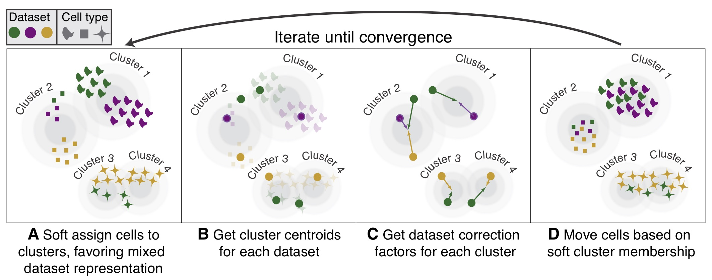

# 📙 Report

Author: ZHANG, Yiling\
Date: 27/10 - 6/11\
Paper:  [A pan-cancer single-cell transcriptional atlas of tumor infiltrating myeloid cells, Cheng,Sijin et al.,Cell,2021](https://www.cell.com/cell/fulltext/S0092-8674\(21\)00010-6#secsectitle0075)


Here is the **Report** for assignment. Other notebooks and files please refer to: 

* **Paper Reproduction Notebook:**  :point\_right:[LING-Notebook for Python](https://files.gitbook.com/v0/b/gitbook-x-prod.appspot.com/o/spaces%2FapieLloV8ZqobtO01up9%2Fuploads%2FVk499jB1kdPqdV1rn3ch%2FPaperReproduction.html?alt=media\&token=562f72fa-b9c3-44e8-bb73-31f4030c8511)
* **Data Exploration Notebook:** :point\_right:[LINK-Notebook for R](https://files.gitbook.com/v0/b/gitbook-x-prod.appspot.com/o/spaces%2FapieLloV8ZqobtO01up9%2Fuploads%2Fa7wVwlaq597mKrRb6g0R%2FPanMyeloidAssignment-Yiling.html?alt=media\&token=205414a7-ae6b-463a-aedd-096efccc11db)   :point\_right:[LINK-Notebook for Python](https://files.gitbook.com/v0/b/gitbook-x-prod.appspot.com/o/spaces%2FapieLloV8ZqobtO01up9%2Fuploads%2FPYIsIRAU8x82Xh1uxVbq%2FDataExploration-scGen.html?alt=media\&token=343257d5-0e2a-46da-86e8-f6468a7199e1)
* **Source Code:** [GitHub-hiiiyilingzhang/PanMyeloid-assignment](https://github.com/hiiiyilingzhang/PanMyeloid-assignment)
* [troubleshooting.md](troubleshooting.md "mention")


## Summary

Single-cell RNA sequencing(scRNA-seq) continues to grow at an unprecedented pace, and while achievements and challenges co-exist when integrating data. Samples, conditions, modalities, or batches all deserve extra attention for data integration, which holds the promise for better characterization of cell identities. According to the statistics, 147 tools have been developed for scRNA-seq data integration\[1,2]. Understanding the idea of algorithm is extremely important for choosing analytical method. In this assignment, I replicated Figure S3A from the paper published on Cell [(Cheng et al., 2021)](https://www.cell.com/cell/fulltext/S0092-8674\(21\)00010-6#supplementaryMaterial), trying to integrate datasets with 7 cancer types, 46 patients and 45251 myeloid cells via bbknn and Scanorama. Furthermore, I employed other integration tools, like scGen, Harmony and LIGER, and evaluate the integration results with the help of LISI method.

## Data Description


I downloaded newly generated datasets([GSE154763](https://www.ncbi.nlm.nih.gov/geo/query/acc.cgi?acc=GSE154763)) for LYM, PAAD, UCEC, MYE, ESCA and OV-FTC and collected dataset([GSE146771](https://www.ncbi.nlm.nih.gov/geo/query/acc.cgi?acc=GSE146771)) for CRC. Notably, CRC dataset, including 10X 3' and Smart-Seq2, is only available for raw TPM counts, while other datasets have already pass the quality control procedure and normalized. For the samples here, we can observe the various cell number for each patient (e.g., P1228 has 22 cells, P0408 has 6556 cells). The huge variability may come from tissue/cell types, inaccurate estimation of input cell number, or poor conditions and death of cells during experiments\[3].

## Data Analysis Processing

### Paper Reproduction

.png>)

#### 1. Quality Control for CRC Dataset

CRC datasets were initialized into `Seurat Object` after downloaded and quality control was applied to both cells and genes according to the parameters provided in the paper. The R code can be found [here](https://github.com/hiiiyilingzhang/PanMyeloid-assignment/blob/main/src/script/R.script/CRC-preprocess.R).

> Specifically, cells with less than 2000 UMI count and 500 detected genes were filtered, as well as cells with more than 10% mitochondrial gene count. To remove potential doublets, cells with UMI count above 40,000 and detected genes above 5,000 are also filtered out.

CRC metadata has also been amended in order to make it consistent with other newly generated data, including fixing column names and calculating the percentage of count for heat shock protein associated genes (HSP). After quality control, CRC dataset was saved as `.h5seurat` file, which can be converted to `.h5ad` file by package _SeuratDisk_. `.h5ad` file was then loaded into Python and generated `AnnData` object for downstream analysis via _scanpy_.

#### 2. Merging and DimReduc

Newly generated datasets(LYM, PAAD, UCEC, MYE, ESCA and OV-FTC) were downloaded and initialized as joint `AnnData` object. Metadata were amended before, so they can be merged successfully. Next, I followed the dimension reduction procedure from the paper, with 2.000 high-variable genes and 100 PCs selected. Total count per cell, the percentage of mitochondrial gene count and the percentage of count for heat shock protein associated genes (HSP) were regressed out during scaling in order to minimize the effect.

#### 3. Integration and Visualization

Before integration, I examined the data with different batches. The top 100 principal components were used for UMAP visualization implemented in `scanpy.tl.umap` function with default parameters. We can see independent clusters when grouped by patients and platforms, indicating the existence of batches.


Batch-correction has done in two levels: donors and platforms. The authors applied _bbknn_ algorithm with parameter to obtain a batch-corrected space, followed with Scanorama algorithm. Two-round of Scanorama has been performed, one for 3′ library and 5′ library protocols from 10x Genomics, another one for the diverse platforms, including 10x Genomics and inDrop. After batch-correction, we can observe the relatively mixed cell in different situations.


From the integration result, monocytes and macrophages accounted for the largest proportion of tumor-infiltrating myeloid cells(TIMs), while pDCs and cDCs lineage were small sub-population at tumor site.


### Data Exploration


In this section, I tried different batch-correction methods, including scGen, LIGER and Harmony. Seurat v3 failed probably because insufficient memory, according to GitHub [issue#4628](https://github.com/satijalab/seurat/issues/4628). In order to assess the degree of mixing during batch correction and dataset integration, I calculated the metric, Local inverse Simpson’s index (LISI). LISI assigns a diversity score to each cell. It is computed for batch labels, and a score close to the expected number of batches denotes good mixing. For example, `tech_10X` contain three batches: 10X3, 10X5 and Smart-seq2. So, LISI value will ranges from 1 to 3 (1 is perfect separability, 3 is perfect mixing) and has a simple interpretation as the expected number of cells needed to be sampled before three are drawn from the same dataset. 


Violin and box plot were used for LISI visualization and it seems like harmony show the best performance in this scenario. Also, according to an benchmark study on available batch correction methods\[4], Harmony ranked high in different scenario, and unsurprisingly, it was also the best method based on the rank sum. That was EPIC...

> Conclusion of that benchmark paper:
>
> Based on our results, Harmony, LIGER, and Seurat 3 are the recommended methods for batch integration. Due to its significantly shorter runtime, Harmony is recommended as the first method to try, with the other methods as viable alternatives.

.png>)

## Algorithms used

### 1. bbknn

[GitHub-Teichlab/bbknn: Batch balanced KNN](https://github.com/Teichlab/bbknn)

[2019-Bioinformatics-BBKNN: fast batch alignment of single cell transcriptomes](https://academic.oup.com/bioinformatics/article/36/3/964/5545955)

* **Highlights:** simple, fast and lightweight;
* **Methods:** graph-based
  * finding the _k_ nearest neighbours for each cell in each user-defined batch independently
  *   The neighbour sets are subsequently merged and processed via UMAP

      
*   **Key parameters:**

    ```
     bbknn.bbknn(adata, batch_key='batch', use_rep='X_pca', approx=True, use_annoy=True, metric='euclidean', copy=False, **kwargs)
    ```

    * batch\_key : `adata.obs` column name discriminating between batches.
    * neighbors\_within\_batch :`int`, optional (default: 3), How many top neighbours to report for each batch; This then serves as the basis for the construction of a symmetrical matrix of connectivities.

### 2. Scanorama

[GitHub-brianhie.scanorama: Panoramic stitching of single cell data](https://github.com/brianhie/scanorama)

[2019-NBT-Efficient integration of heterogeneous single-cell transcriptomes using Scanorama](https://www.nature.com/articles/s41587-019-0113-3/)

*   **Highlights:** Maintain the heterogeneity with each sample

    > Scanorama is robust to different dataset sizes and sources, preserves dataset-specific populations and does not require that all datasets share at least one cell population.
*   **Methods:** Analogous to computer vision algorithms for panorama stitching that identify images with overlapping content, mutual nearest-neighbors matching

    > Scanorama automatically identifies scRNA-seq datasets containing cells with similar transcriptional profiles and can leverage those matches for batch correction and integration, without also merging datasets that do not overlap
    >
    > Our approach generalizes mutual nearest-neighbors matching, a technique that finds similar elements between two datasets, to instead find similar elements among many datasets. 
* **Key Procedures:** How to search for matching cells?
  1. Compress the gene expression profiles of each cell into a low-dimensional embedding via SVD;
  2. Perform approximate nearest neighbor search based on hyperplane locality sensitive hashing and random projection trees to greatly reduce the nearest neighbor query time;
* **Output:** Two lists
  * List 1: Integrated embeddings;
  * List 2: Corrected counts for each dataset.

### 3. scGen

[GitHub - theislab/scgen: single cell perturbation prediction](https://github.com/theislab/scgen)

[2019 - Nat. Methods - scGen predicts single-cell perturbation responses](https://www.nature.com/articles/s41592-019-0494-8)

* **Highlights:** Usage in several contexts including perturbation prediction response for unseen phenomena across cell types, studies and species, for interpolating cells between conditions.
* **Methods:** Variational autoencoder (VAE) model trained on a reference dataset first(for supervised mode)
  * Step1: Perform deep neural networks with VAEs to build a model that learns the distribution of cells in the reference dataset
  * Step2: Trained network is used to predict the distribution of the query dataset


### 4. Harmony

[GitHub - immunogenomics/harmony: Fast, sensitive and accurate integration of single-cell data with Harmony](https://github.com/immunogenomics/harmony)

[2019 - Nat. Methods - Fast, sensitive and accurate integration of single-cell data with Harmony](https://www.nature.com/articles/s41592-019-0619-0)

* **Highlights:** Faster and perform quite well in a recent benchmark. Convenient wrappers for interfacing with `Seurat`
*   **Methods:**

    > The theory behind this algorithm is based on the Mixture of Experts model. This is a natural extension of linear modeling, in which each cluster is deemed an expert and is assigned its own linear model.
    >
    > [Detailed Walkthrough of Harmony Algorithm](https://portals.broadinstitute.org/harmony/advanced.html)



* **Steps:**
  * L\_2 scaling to induce cosine distance
  * Kmeans to find initial locations for the cluster centroids
  * Evaluate the initial diversity of clustering by aggregating the number of cells from each batch assigned to each cluster
  * Maximum-diversity soft-clustering, iterating between two steps: centroid estimation and cluster assignment
  * Re-assigned cells to maximize diversity within the clusters
  * Re-position cluster centroids to be close to their assigned cells
  * Correct the data in a sensitive way

### 5. LIGER

[GitHub - welch-lab/liger: R package for integrating and analyzing multiple single-cell datasets](https://github.com/welch-lab/liger)

[2019 - Cell - Single-Cell Multi-omic Integration Compares and Contrasts Features of Brain Cell Identity](https://www.cell.com/cell/fulltext/S0092-8674\(19\)30504-5)

* **Highlights: **Sensitive to technical variation and applicable for synchronized integration of cross-domain assays
* **Methods:** Identifying shared and dataset-specific factors through integrative non-negative matrix factorization (iNMF)
  * Two major steps:
    1. Integrative nonnegative matrix factorization with dataset-specific factors
    2. Increases robustness by joint clustering using shared factor neighborhood graph (connect cells across datasets that have similar factor loading patterns, then identify joint clusters by performing community detection on this graph)
  * Defined a set of latent metagene factors, each with both shared and dataset-specific components, to approximate the original datasets
* **Workflow:**
  1. Dataset preprocessing to produce a raw digital gene expression (DGE) matrix.
  2. Variable gene selection, normalization by number of UMIs, and scaling of individual genes. We scale but do not center gene expression because NMF requires non-negative values.
  3. Identifying shared and dataset-specific factors through integrative non-negative matrix factorization (iNMF). We have derived and implemented a novel coordinate descent algorithm for efficiently performing the factorization.
  4. Jointly clustering cells and normalizing factor loadings.
  5. Visualization using t-SNE or UMAP and analysis of shared and dataset-specific marker genes.
* **Key parameters:**

| `lambda`            | Regularization parameter. Larger values penalize dataset-specific effects more strongly.                                                 |
| ------------------- | ---------------------------------------------------------------------------------------------------------------------------------------- |
| \`miniBatch\_size\` | Total number of cells in each minibatch (default 5000). A smaller value such as 1000 may be necessary for analyzing very small datasets. |

### 6. LISI

[GitHub - immunogenomics/LISI: Methods to compute Local Inverse Simpson's Index (LISI)](https://github.com/immunogenomics/LISI)

[2019 - Nat. Methods - Fast, sensitive and accurate integration of single-cell data with Harmony](https://www.nature.com/articles/s41592-019-0619-0)

* **Highlights:** Sensitive to local distances and easy interpretation
* **Methods:** Perplexity-based neighborhood construction and the Inverse Simpson’s Index.
  *   Gaussian kernel-based distributions of neighborhoods: gives distance-based weights to cells in the neighborhood;

      
  *   inverse Simpson’s Index (1/Σ_b_=1_B\*\*p_(_b_)): refer to batch probabilities in the local neighborhood distributions.

      
* **Output:** A data frame of LISI values. Each row is a cell and each column is a different label\variable.

## Discussion

The goal of integration is to ensure that the cell types of one condition align with the same cell types of of the other condition. In other words, if we observe condition-specific clustering, it may indicates that we need to integrate the cells across conditions to ensure that cells of the same cell type cluster together. As the choice of batch correction method may impact the downstream analyses, the decision of which one to use should be really careful. Usually, researches use benchmark studies as guidance.

Here in this PanMyeloid study, authors employed _bbknn_ methods to deal with batches between patients. The whole dataset consists by 210 patients, so computational resource requirements should be considered as an important factor when choosing a method. In the benchmark studies, _BBKNN_ shows less running time as the number of cells grow, and the performance remains stable as the number of batches increases, while other methods (expect for Harmony) will struggle to integrate hundreds of batches even if each batch is relatively small\[4,5].

Several metrics have been raised up to evaluate if cells with similar expression profiles end up near each other, like Shannon entropy, mixing entropies, inverse Simpson index\[4,6]. These metrics can serve as a hint for researchers, even if they may not be relevant to all datasets and research questions.

## Reference

\[1] [https://www.scrna-tools.org/analysis](https://www.scrna-tools.org/analysis)

\[2] [Zappia L, Phipson B, Oshlack A. "Exploring the single-cell RNA-seq analysis landscape with the scRNA-tools database", PLOS Computational Biology (2018)](https://journals.plos.org/ploscompbiol/article?id=10.1371/journal.pcbi.1006245)

\[3] [Xiliang W, Yao H, Qiming Z, Xianwen R, Zemin Z, Direct Comparative Analyses of 10X Genomics Chromium and Smart-seq2, Genomics, Proteomics & Bioinformatics (2021)](https://www.sciencedirect.com/science/article/pii/S1672022921000486)

\[4] [Tran, H.T.N., Ang, K.S., Chevrier, M. _et al._ A benchmark of batch-effect correction methods for single-cell RNA sequencing data. _Genome Biol_ 21\*\*,\*\* 12 (2020)](https://genomebiology.biomedcentral.com/articles/10.1186/s13059-019-1850-9#Abs1)

\[5] [Ruben C.G, Stijn D., Vladimir Y K., Martin H., Flexible comparison of batch correction methods for single-cell RNA-seq using BatchBench, _Nucleic Acids Research_ (2021)](https://doi.org/10.1093/nar/gkab004)

\[6] [Haghverdi, L., Lun, A., Morgan, M. _et al._ Batch effects in single-cell RNA-sequencing data are corrected by matching mutual nearest neighbors. _Nat Biotechnol_ (2018)](https://doi.org/10.1038/nbt.4091)
