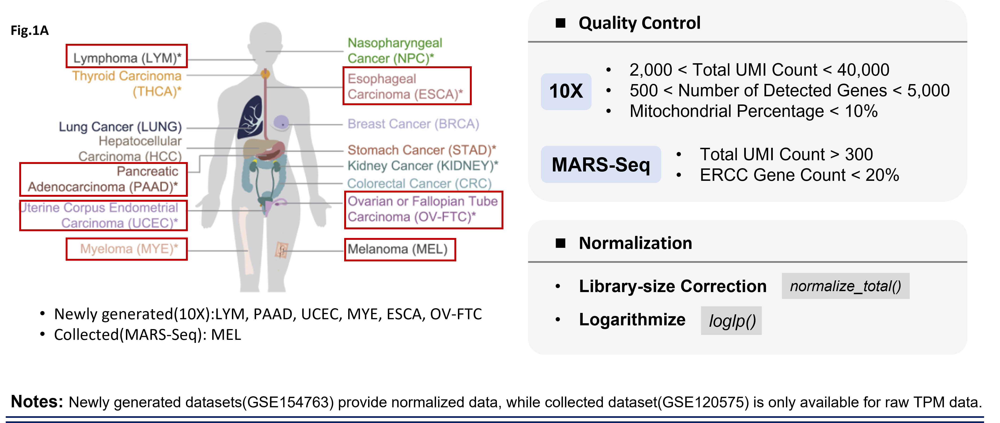

```{r include=FALSE}
knitr::opts_chunk$set(
  echo = TRUE,
  message = FALSE,
  warning = FALSE,
  fig.align = "center",
  fig.width = 6,
  autodep = TRUE,
  cache.lazy = FALSE
)
```

# Paper Reproduction

```{r echo=FALSE,out.width = '90%',fig.align = "center"}

```

## 1. Environment Setting
```{bash eval=FLASE}
conda activate scanpy-1.4.3
```

```{python eval=FLASE}
import numpy as np
import pandas as pd
import scanpy as sc

sc.settings.verbosity = 3    # errors (0), warnings (1), info (2), hints (3)
sc.settings.set_figure_params(dpi=80)
```

## 2. Initialize Data
```{python eval=FALSE}
ESCA = sc.AnnData(counts_df)
```


# Data Exploration

```{r}
library(Seurat)
```

# Supplemental Information

<details><summary>**▶ Session Info**</summary>
```{r echo=FALSE}
sessionInfo()
```
</details>


<details><summary>**▶ Server Info**</summary>
* Linux Version
```{bash echo=FALSE}
cat /etc/os-release
```

* CPU info
```{bash echo=FALSE}
lscpu | head -25
```
</details>