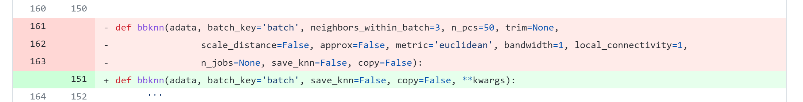

# 😭 TROUBLESHOOTING

## Environment Setting

### file size doesn't match expectation


```
 mamba install -c conda-forge python-igraph leidenalg
```

replacing `memba install`with `conda install` is perfectly normal\


**SOLUTION:** change mirror&#x20;

[https://www.gitmemory.com/issue/mamba-org/mamba/1177/925578777](https://www.gitmemory.com/issue/mamba-org/mamba/1177/925578777)

> I think the problem might be that the `mirrors.bfsu.edu.cn` return the wrong data because no `User-Agent` is set

```
 # https://mirrors.sustech.edu.cn/help/anaconda.html#introduction

 conda config --add channels https://mirrors.sustech.edu.cn/anaconda/pkgs/free/ 
 conda config --add channels https://mirrors.sustech.edu.cn/anaconda/pkgs/main/ 
 conda config --set show_channel_urls yes
```

## Initialize Data

### invalid compressed data length error


```
gunzip GSE154763_ESCA_normalized_expression.csv.gz
gzip -t GSE154763_ESCA_normalized_expression.csv.gz
```

**Check data integrity**

```
import os
import gzip

def check_integrity(local_file):
    if local_file.endswith('.gz'):
        with gzip.open(local_file, 'rb') as f:
            try:
                f.seek(-1, os.SEEK_END)
            except:
                return -1
    return 0

# Go through dir and check integrity
# Return error data (gunzip shows invalid compressed data)
for curDir, dirs, files in os.walk("../rawData"):
    for file in files:
        if check_integrity(os.path.join(curDir, file))!=0:
            print(os.path.join(curDir, file))
```


**SOLUTION: **Transfer it again, in binary mode

FTP transfer files based on **netascii** by default, not binary, which will cause the **FTP/ASCII corruption**. Therefore, needs to specify whether it is a binary or ASCII file.

[**gzip: stdin: invalid compressed data--format violated ftp ascii transfer**](https://www.linuxquestions.org/questions/linux-software-2/gzip-stdin-invalid-compressed-data-format-violated-ftp-ascii-transfer-629128/?\_\_cf\_chl\_jschl\_tk\_\_=pmd\_5icZZ6dIDO4xRyw0EcfhjwzdaSaBMKFdUAn4XWhwtYU-1635323229-0-gqNtZGzNAuWjcnBszQjl)

## Version-related Errors

### bbknn and umap-learn

> TypeError: bbknn() got an unexpected keyword argument 'save\_knn'
>
> msg() got an unexpected keyword argument 'deep'
>
> AxisArrays' object has no attribute 'dtype'
>
> AttributeError: 'tuple' object has no attribute 'tocsr'

Errors above are all about the package version. Here we can see the different input parameters in `bbknn()` and `sc.external.pp.bbknn()`










* bbknn \_\__init\_\__got changes in 1.3.0



* Modify the input parameter again in 1.3.2


* Support `.keys` instead `.obsm` in 1.3.4


* Problem solved by using** bbknn 1.3.4** and **umap-learn 1.3.9**

## Random Errors

* can't see input on command line lol

```
 echo -e "\033[?25h"
```

\
\
